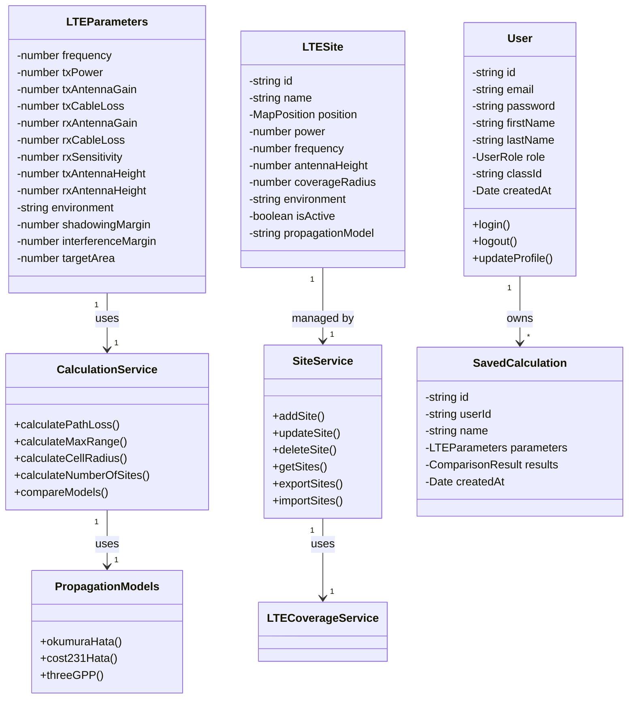
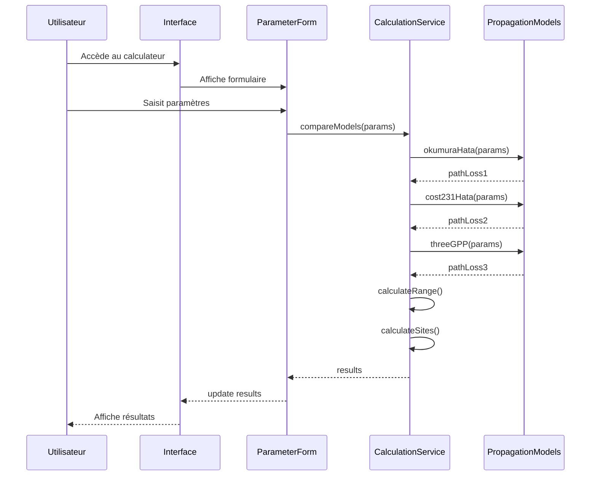
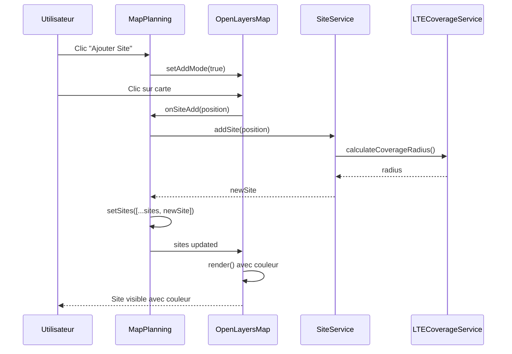
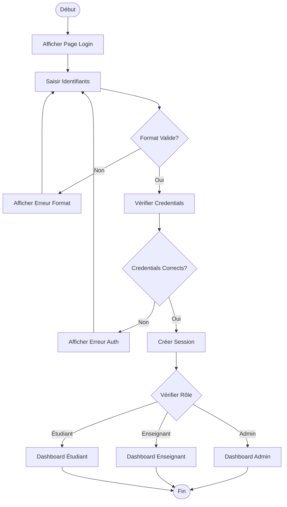
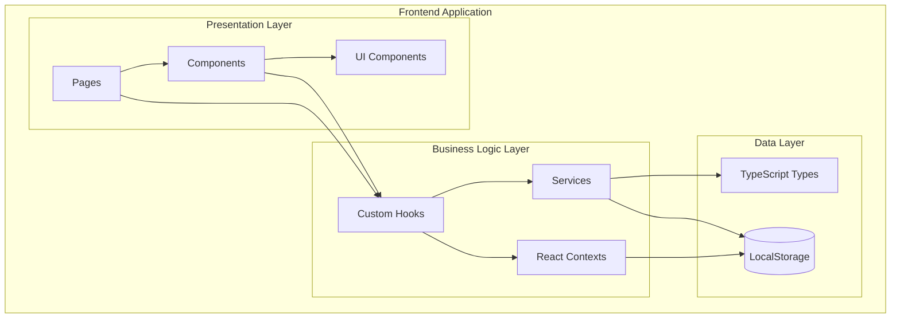
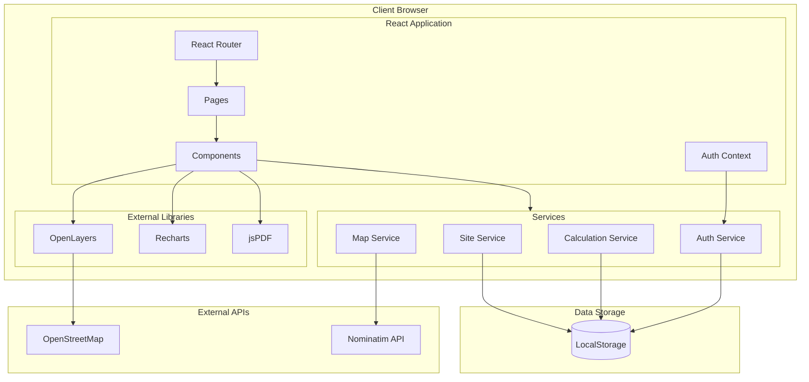
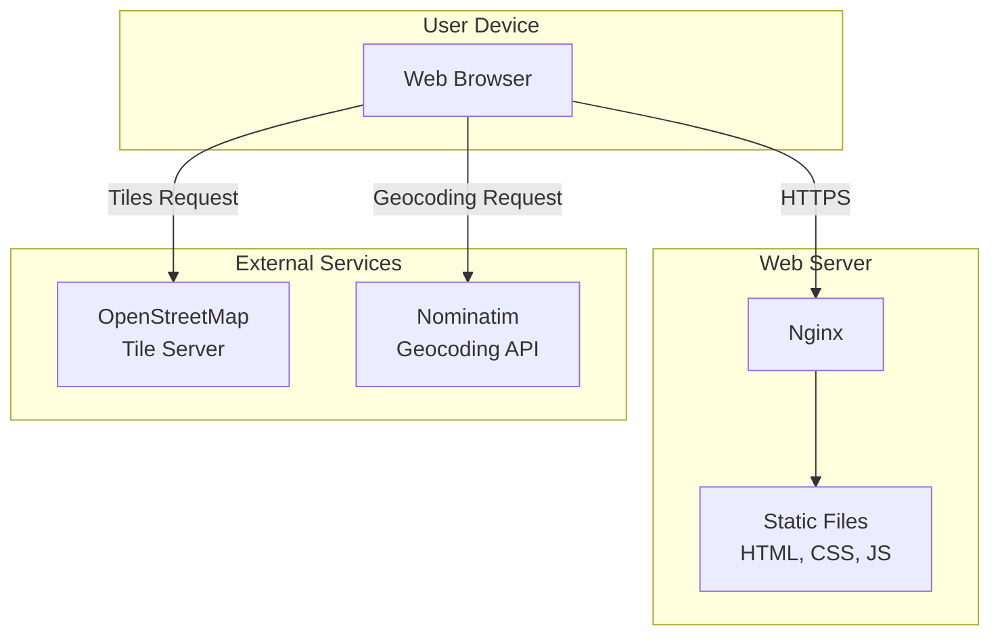
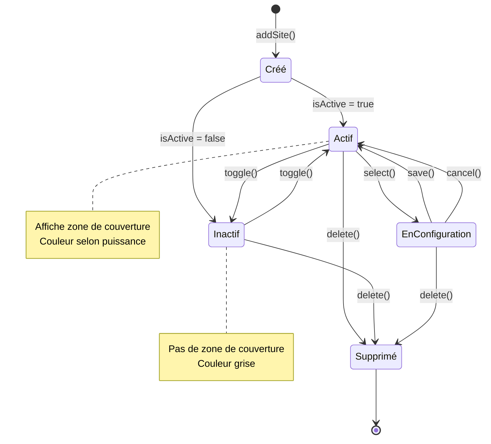
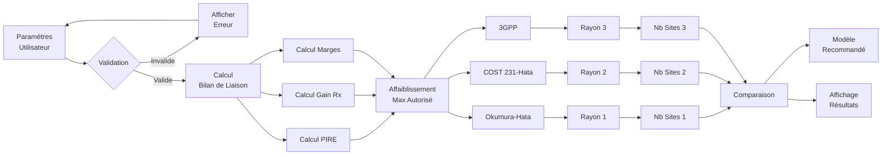

# DIAGRAMMES DU PROJET - Outil de Dimensionnement LTE

## 1. Diagramme de Cas d'Utilisation

```mermaid
graph TB
    subgraph "Système de Dimensionnement LTE"
        UC1[Effectuer Calcul LTE]
        UC2[Enregistrer Calcul]
        UC3[Charger Calcul]
        UC4[Planifier sur Carte]
        UC5[Exporter Projet]
        UC6[Importer Projet]
        UC7[Modifier Profil]
        UC8[Consulter Stats Classe]
        UC9[Générer Rapport PDF]
        UC10[Gérer Utilisateurs]
        UC11[Gérer Classes]
        UC12[Consulter Stats Globales]
    end
    
    Etudiant((Étudiant))
    Enseignant((Enseignant))
    Admin((Administrateur))
    
    Etudiant --> UC1
    Etudiant --> UC2
    Etudiant --> UC3
    Etudiant --> UC4
    Etudiant --> UC5
    Etudiant --> UC6
    Etudiant --> UC7
    
    Enseignant --> UC1
    Enseignant --> UC2
    Enseignant --> UC3
    Enseignant --> UC4
    Enseignant --> UC5
    Enseignant --> UC6
    Enseignant --> UC7
    Enseignant --> UC8
    Enseignant --> UC9
    
    Admin --> UC1
    Admin --> UC2
    Admin --> UC3
    Admin --> UC4
    Admin --> UC5
    Admin --> UC6
    Admin --> UC7
    Admin --> UC8
    Admin --> UC9
    Admin --> UC10
    Admin --> UC11
    Admin --> UC12
```

## 2. Diagramme de Classes Simplifié

## 3. Diagramme de Séquence - Calcul de Dimensionnement

## 4. Diagramme de Séquence - Planification sur Carte

## 5. Diagramme d'Activité - Authentification

## 6. Diagramme de Composants

## 7. Diagramme d'Architecture

## 8. Diagramme de Déploiement

## 9. Diagramme d'État - Site LTE

## 10. Diagramme de Flux de Données - Calcul LTE

---

**Note:** Ces diagrammes peuvent être visualisés avec des outils compatibles Mermaid comme:
- GitHub (rendu automatique)
- VS Code (avec extension Mermaid)
- draw.io (import Mermaid)
- mermaid.live (éditeur en ligne)
